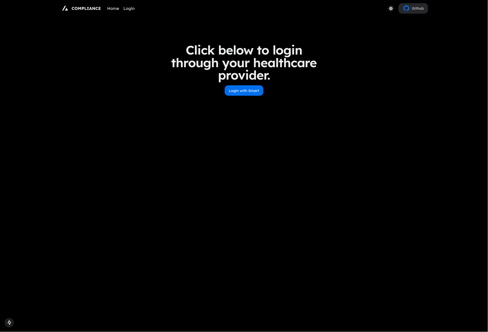
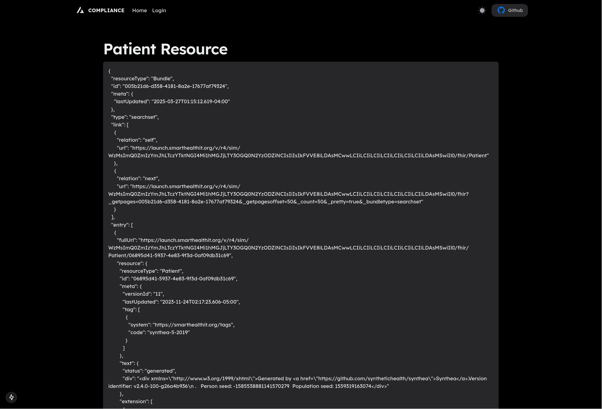

# Compliance Monitor

## Technologies Used

- [Next.js 14](https://nextjs.org/docs/getting-started)
- [HeroUI v2](https://heroui.com/)
- [Tailwind CSS](https://tailwindcss.com/)
- [Tailwind Variants](https://tailwind-variants.org)
- [TypeScript](https://www.typescriptlang.org/)
- [Framer Motion](https://www.framer.com/motion/)
- [next-themes](https://github.com/pacocoursey/next-themes)
- [Smart on Fhir](https://docs.smarthealthit.org/client-js/)
- [Biome](https://biomejs.dev/)
- [pnpm](https://pnpm.io/)

## How to Use

### Install dependencies

Only tested and developed with pnpm

```bash
pnpm install
```

### Run the development server

```bash
pnpm run dev
```

## Screenshots

### Home


### User page after login
